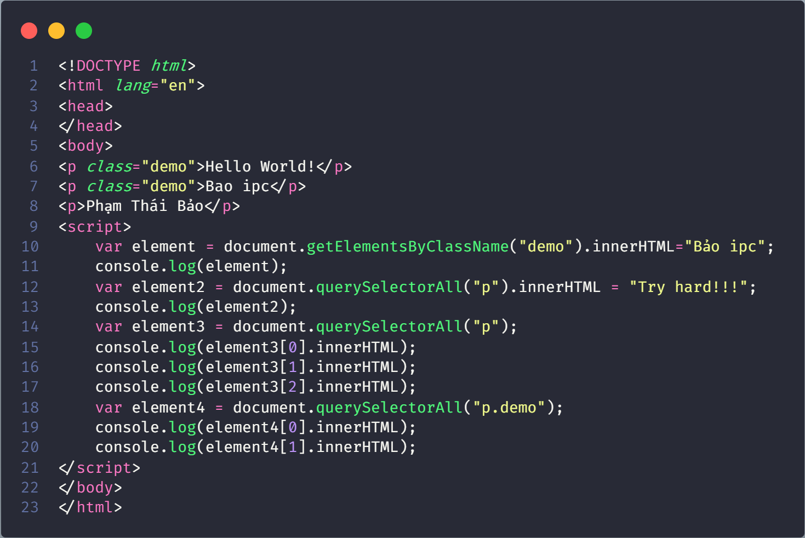
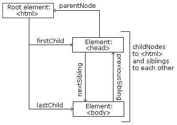
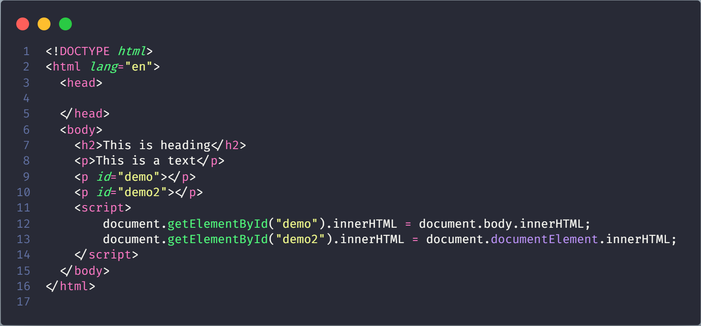

# JS HTML DOM

## JavaScript HTML DOM

With the HTML DOM, JavaScript can access and change all the elements of an HTML document

### The HTML DOM (Document Object Model)

When a web page is loaded, the browser creates a **D**ocument **O**bject **M**odel of the page.

The **HTML DOM** model is constructed as a tree of **Objects**:


With the object model, JavaScript gets all the power it needs to create dynamic HTML:

- JavaScript can change all the HTML elements in the page

- JavaScript can change all the HTML attributes in the pa

- JavaScript can change all the CSS styles in the page

- JavaScript can remove existing HTML elements and attribute

- JavaScript can add new HTML elements and attributes

- JavaScript can react to all existing HTML events in the pa

- JavaScript can create new HTML events in the pa

### What You Will Learn

- How to change the content of HTML elements

- How to change the style (CSS) of HTML elements

- How to react to HTML DOM events

- How to add and delete HTML elements

### What is the DOM?

The DOM is a W3C (World Wide Web Consortium) standard.

The DOM defines a standard for accessing documents:

"The W3C Document Object Model (DOM) is a platform and language-neutral interface that allows programs and scripts to dynamically access and update the content, structure, and style of a document."

The W3C DOM standard is separated into 3 different parts:

- Core DOM - standard model for all document types

- XML DOM - standard model for XML documents

- HTML DOM - standard model for HTML documents

### What is the HTML DOM?

The HTML DOM is a standard object model and programming interface for HTML. It defines:

- The HTML elements as Objects

- The properties of all HTML elements

- The methods to access all HTML elements

- The events for all HTML elements

In other words: **The HTML DOM is a standard for how to get, change, add, or delete HTML elements.**

----

## JavaScript - HTML DOM Methods

HTML DOM methods are actions you can perform (on HTML Elements).

HTML DOM properties are values (of HTML Elements) that you can set or change.

### The DOM Programming Interface

The HTML DOM can be accessed with JavaScript (and with other programming languages).

In the DOM, all HTML elements are defined as **objects**.

The programming interface is the properties and methods of each object.

A **property** is a value that you can get or set (like changing the content of an HTML element).

A **method** is an action you can do (like add or deleting an HTML element).


```json
In the example above: 
getElementById is a method
while innerHTML is a property.
```

### The getElementById Method

The most common way to access an HTML element is to use the id of the element.

In the example above the getElementById method used id="demo" to find the element.

### The innerHTML Property

The easiest way to get the content of an element is by using the innerHTML property.

The innerHTML property is useful for getting or replacing the content of HTML elements.

> The innerHTML property can be used to get or change any HTML element, including tag html and tag body.

----

## JavaScript HTML DOM Document

The HTML DOM document object is the owner of all other objects in your web page.

### The HTML DOM Document Object

The document object represents your web page.

If you want to access any element in an HTML page, you always start with accessing the document object.

Below are some examples of how you can use the document object to access and manipulate HTML.

#### Finding HTML Elements

|**Method**|**Description**|
|----------|---------------|
|document.getElementById(*id*)|Find *an element* by element id|
|document.getElementsByTagName(name)|Find *elements* by tag name|
|document.getElementsByClassName(name)|Find *elements* by class name|

#### Changing HTML Elements

|**Property**|**Description**|
|----------|---------------|
|element.innerHTML =  new html content|Change the inner HTML of an element|
|element.attribute = new value|Change the attribute value of an HTML element|
|element.style.property = new style|Change the style of an HTML element|

|**Method**|**Description**|
|----------|---------------|
|element.setAttribute(attribute, value)|Change the attribute value of an HTML element|

#### Adding and Deleting Elements

|**Method**|**Description**|
|----------|---------------|
|document.createElement(element)|Create an HTML element|
|document.removeChild(element)|Remove an HTML element|
|document.appendChild(element)|Add an HTML element|
|document.replaceChild(new, old)|Replace an HTML element|
|document.write(text)|Write into the HTML output stream|

#### Adding Events Handlers

|**Method**|**Description**|
|----------|---------------|
|document.getElementById(id).onclick = function(){code}|Adding event handler code to an onclick event|

#### Finding HTML Objects

[Read more](https://www.w3schools.com/js/js_htmldom_document.asp)

----

## JavaScript HTML DOM Elements

Often, with JavaScript, you want to manipulate HTML elements.

To do so, you have to find the elements first. There are several ways to do this:

- Finding HTML elements by id

- Finding HTML elements by tag name

- Finding HTML elements by class name

- Finding HTML elements by CSS selectors

- Finding HTML elements by HTML object collections

### Finding HTML Element by Id


```json
<p id="demo">Hello</p> 
object
null
```

If the element is found, the method will return the element as an object (in element)

If the element is not found, element will contain `null`.

### Finding HTML elements by tag name


```json
HTMLCollection(5) [p#demo, p#demo, p#demo2, p, p, demo: p#demo, demo2: p#demo2]
    0: p#demo
    1: p#demo
    2: p#demo2
    3: p
    4: p
    demo: p#demo
    demo2: p#demo2
    length: 5
object
HTMLCollection []
    length: 0
Bảo ipc
```

> `document.getElementById("main").getElementsByTagName("p")`: Find all `<p>` elements inside `main`

### Finding HTML elements by class name


```json
HTMLCollection [p.demo]
    0: p.demo
    length: 1
object
undefined
Hello
```

### Finding HTML elements by CSS selectors

If you want to find all HTML elements that match a specified CSS selector (id, class names, types, attributes, values of attributes, etc), use the `querySelectorAll()` method.


```json
object
undefined
undefined
Hello World!
Hello
```

[Read more to revise CSS selector](https://www.w3schools.com/css/css_selectors.asp)

### Finding HTML elements by HTML object collections


```json
[object HTMLInputElement] [object HTMLInputElement] [object HTMLInputElement] 
text text submit 
fname lname  
Donald Duck Submit
```

### JavaScript HTML DOM - Changing HTML

#### Changing HTML Content

The easiest way to modify the content of an HTML element is by using the `innerHTML` property.



```json
Bảo ipc
Try hard!!!
Hello World!
Bao ipc
Phạm Thái Bảo
Hello World!
```

#### Changing the Value of an Attribute

To change the value of an HTML attribute, use this syntax:

`document.<MethodToGetTheElement>.<AttributeWantChange> = new value`


```json
https://www.w3schools.com/js/js_htmldom_html.asp
https://www.youtube.com/watch?v=Gq_fCeyhHeU
```

#### Dynamic HTML content


```json
Phạm Thái Bảo
Sun Jan 09 2022 01:17:55 GMT+0700 (Giờ Đông Dương)
Sun Jan 09 2022 01:17:55 GMT+0700 (Giờ Đông Dương)
```

### JavaScript Forms

#### Data Validation

Data validation is the process of ensuring that user input is clean, correct, and useful.

Typical validation tasks are:

- has the user filled in all required fields?
- has the user entered a valid date?
- has the user entered text in a numeric field?

Most often, the purpose of data validation is to ensure correct user input.

Validation can be defined by many different methods, and deployed in many different ways.

**Server side validation** is performed by a web server, after input has been sent to the server.

**Client side validation** is performed by a web browser, before input is sent to a web server.

#### JavaScript Form Validation


#### JavaScript Can Validate Numeric Input


#### Automatic HTML Form Validation

HTML form validation can be performed automatically by the browser:

If a form field `fname` is empty, the `required` attribute prevents this form from being submitted:

```json
<form action="/action_page.php" method="post">
  <input type="text" name="fname" required>
  <input type="submit" value="Submit">
</form>
```

#### HTML Constraint Validation

HTML5 introduced a new HTML validation concept called constraint validation.

HTML constraint validation is based on:

- Constraint validation HTML Input Attributes
- Constraint validation CSS Pseudo Selectors
- Constraint validation DOM Properties and Methods

[Read more to know](https://www.w3schools.com/js/js_validation.asp)

### JavaScript HTML DOM - Changing CSS

#### Changing HTML Style

> document.getElementById(*id*).style.*property* = *new style*


#### Using Events

Events are generated by the browser when "things happen" to HTML elements:

- An element is clicked on
- The page has loaded
- Input fields are changed


### JavaScript HTML DOM Animation


### JavaScript HTML DOM Events

#### Reacting to Events

A JavaScript can be executed when an event occurs, like when a user clicks on an HTML element.

```json
Syntax: onclick=JavaScript
```

Example of HTML events:

- When a user clicks the mouse
- When a web page has loaded
- When an image has been loaded
- When the mouse moves over an element
- When an input field is changed
- When an HTML form is submitted
- When a user strokes a key

[Video Example. Choose: DOM_Events_Reacting.wmv](https://drive.google.com/drive/u/0/folders/1f6oLoiERqp5IDaxoDzjCV1OMvLvJcnaS)

#### HTML Event Attributes  

[Video Example. Choose: DOM_Events_HTMLEventAttributes.wmv](https://drive.google.com/drive/u/0/folders/1f6oLoiERqp5IDaxoDzjCV1OMvLvJcnaS)

#### Assign Events Using the HTML DOM

[Video Example. Choose: DOM_Events_AssignEvents.wmv](https://drive.google.com/drive/u/0/folders/1f6oLoiERqp5IDaxoDzjCV1OMvLvJcnaS)

#### The `onload` and `onunload` Events

The `onload` and `onunload` events are triggered when the user enters or leaves the page.

The `onload` event can be used to check the visitor's browser type and browser version, and load the proper version of the web page based on the information.

The `onload` and `onunload` events can be used to deal with cookies.

[Read more to know](https://www.w3schools.com/jsref/event_onload.asp)

#### The onchange Event

The `onchange` event is often used in combination with validation of input fields.

.png)

[Video Example. Choose: DOM_Events_onchage().wmv](https://drive.google.com/drive/u/0/folders/1f6oLoiERqp5IDaxoDzjCV1OMvLvJcnaS)

#### The onmouseover and onmouseout Events

The `onmouseover` and `onmouseout` events can be used to trigger a function when the user mouses over, or out of, an HTML element


[Video Example. Choose: DOM_Events_onmouseover& onmouseout.wmv](https://drive.google.com/drive/u/0/folders/1f6oLoiERqp5IDaxoDzjCV1OMvLvJcnaS)

#### The onmousedown, onmouseup and onclick Events

The `onmousedown`, `onmouseup`, and `onclick` events are all parts of a mouse-click. First when a mouse-button is clicked, the onmousedown event is triggered, then, when the mouse-button is released, the onmouseup event is triggered, finally, when the mouse-click is completed, the onclick event is triggered.


[Video Example. Choose: DOM_Events_onmousedown& onmouseup.wmv](https://drive.google.com/drive/u/0/folders/1f6oLoiERqp5IDaxoDzjCV1OMvLvJcnaS)

### JavaScript HTML DOM EventListener

#### The addEventListener() method

The `addEventListener()` method attaches an event handler to the specified element.

The `addEventListener()` method attaches an event handler to an element without overwriting existing event handlers.

You can **add many event handlers to one element**.

You can **add many event handlers of the same type to one element, i.e two "click" events**.

You can **add event listeners to any DOM object not only HTML elements**. i.e the window object.

The `addEventListener()` method makes it easier to control how the event reacts to bubbling.

When using the `addEventListener()` method, the **JavaScript is separated from the HTML markup**, for better readability and allows you to add event listeners even when you do not control the HTML markup.

You can easily remove an event listener by using the `removeEventListener()` method.

**Syntax**:

```js
element.addEventListener(event, function, useCapture);
```

The first parameter is the type of the event

The second parameter is the function we want to call when the event occurs.

The third parameter is a boolean value specifying whether to use event bubbling or event capturing. **This parameter is optional**.

#### Add an Event Handler to an Element


[Video Example. Choose: DOM_EventListener_AddEventHandlerElement.wmv](https://drive.google.com/drive/u/0/folders/1f6oLoiERqp5IDaxoDzjCV1OMvLvJcnaS)

#### Add Many Event Handlers to the Same Element

The `addEventListener()` method allows you to add many events to the same element, without overwriting existing events


[Video Example. Choose: DOM_EventListener_SameElement.wmv](https://drive.google.com/drive/u/0/folders/1f6oLoiERqp5IDaxoDzjCV1OMvLvJcnaS)

#### Add an Event Handler to the window Object

The `addEventListener()` method allows you to add event listeners on any HTML DOM object such as HTML elements, the HTML document, the window object, or other objects that support events, like the `xmlHttpRequest` object.

[Read more Event Handler to the window Object](https://www.w3schools.com/js/js_htmldom_eventlistener.asp)

#### Passing Parameters

When passing parameter values, use an "anonymous function" that calls the specified function with the parameters


[Video Example. Choose: DOM_EventListener_PassingParameters.wmv](https://drive.google.com/drive/u/0/folders/1f6oLoiERqp5IDaxoDzjCV1OMvLvJcnaS)

#### Event Bubbling or Event Capturing?

Here are two ways of event propagation in the HTML DOM, bubbling and capturing.

Event propagation is a way of defining the element order when an event occurs. If you have a `<p>` element inside a `<div>` element, and the user clicks on the `<p>` element, which element's "click" event should be handled first?

In *bubbling* **the inner most element's event is handled first and then the outer**: the `<p>` element's click event is handled first, then the `<div>` element's click event.

In *capturing* **the outer most element's event is handled first and then the inner**: the `<div>` element's click event will be handled first, then the `<p>` element's click event.


[Video Example. Choose: DOM_EventListener_EventBubbling&Capturing.wmv](https://drive.google.com/drive/u/0/folders/1f6oLoiERqp5IDaxoDzjCV1OMvLvJcnaS)

The **default value is false**, which will use the **bubbling** propagation,When the **value is set to true**, the event uses the **capturing propagation**.

#### The removeEventListener() method

The `removeEventListener()` method removes event handlers that have been attached with the `addEventListener()` method


[Video Example. Choose: DOM_EventListener_removeEventListener.wmv](https://drive.google.com/drive/u/0/folders/1f6oLoiERqp5IDaxoDzjCV1OMvLvJcnaS)

### JavaScript HTML DOM Navigation

With the HTML DOM, you can navigate the node tree using node relationships.

#### DOM Nodes

According to the W3C HTML DOM standard, everything in an HTML document is a node:

- The entire document is a document node
- Every HTML element is an element node
- The text inside HTML elements are text nodes
- Every HTML attribute is an attribute node (deprecated)
- All comments are comment nodes


With the HTML DOM, all nodes in the node tree can be accessed by JavaScript.

New nodes can be created, and all nodes can be modified or deleted.

#### Node Relationships

The nodes in the node tree have a hierarchical relationship to each other.

The terms parent, child, and sibling are used to describe the relationships.

- In a node tree, the top node is called the root (or root node)
- Every node has exactly one parent, except the root (which has no parent)
- A node can have a number of children
- Siblings (brothers or sisters) are nodes with the same parent

```html
<html>

  <head>
    <title>DOM Tutorial</title>
  </head>

  <body>
    <h1>DOM Lesson one</h1>
    <p>Hello world!</p>
  </body>

</html>
```



From the HTML above you can read:

```html
<html> is the root node
<html> has no parents
<html> is the parent of <head> and <body>
<head> is the first child of <html>
<body> is the last child of <html>
and:

<head> has one child: <title>
<title> has one child (a text node): "DOM Tutorial"
<body> has two children: <h1> and <p>
<h1> has one child: "DOM Lesson one"
<p> has one child: "Hello world!"
<h1> and <p> are siblings
```

#### Navigating Between Nodes

You can use the following node properties to navigate between nodes with JavaScript:

```js
parentNode
childNodes[nodenumber]
firstChild
lastChild
nextSibling
previousSibling
```

#### Child Nodes and Node Values

```html
<title id="demo">DOM Tutorial</title>
```

The element node `<title>` (in the example above) does **not** contain text.

It contains a **text node** with the value "DOM Tutorial".

The value of the text node can be accessed by the node's `innerHTML` property:

```js
myTitle = document.getElementById("demo").innerHTML;
```

Accessing the innerHTML property is the same as accessing the `nodeValue` of the first child:

```js
myTitle = document.getElementById("demo").firstChild.nodeValue;
```

Accessing the first child can also be done like this:

```js
myTitle = document.getElementById("demo").childNodes[0].nodeValue;
```


[Video Example. Choose: DOM_Navigation_ChildNodes&NodeValues.wmv](https://drive.google.com/drive/u/0/folders/1f6oLoiERqp5IDaxoDzjCV1OMvLvJcnaS)

#### InnerHTML

In this tutorial we use the innerHTML property to retrieve the content of an HTML element.

However, learning the other methods above is useful for understanding the tree structure and the navigation of the DOM.

#### DOM Root Nodes

There are two special properties that allow access to the full document:

- `document.body` - The body of the document
- `document.documentElement` - The full document



[Video Example. Choose: DOM_Navigation_RootNodes.wmv](https://drive.google.com/drive/u/0/folders/1f6oLoiERqp5IDaxoDzjCV1OMvLvJcnaS)

#### The nodeName Property

The `nodeName` property specifies the name of a node.

- nodeName is read-only
- nodeName of an element node is the same as the tag name
- nodeName of an attribute node is the attribute name
- nodeName of a text node is always #text
- nodeName of the document node is always #document


```json
This is heading
This is a text
H2
P
```

> **Note**: `nodeName` always contains the uppercase tag name of an HTML element.

[Read more](https://developer.mozilla.org/en-US/docs/Web/API/Node/nodeName)

#### The nodeValue Property

The `nodeValue` property specifies the value of a node.

- nodeValue for element nodes is `null`
- nodeValue for text nodes is the text itself
- nodeValue for attribute nodes is the attribute value

#### The nodeType Property

The `nodeType` property is read only. It returns the type of a node.


```json
1
1
```

| Node      | Type | Example     |
| :---        |    :----:   |          --: |
| ELEMENT_NODE      | 1       | `<h1 class="heading">W3Schools</h1>`   |
| ATTRIBUTE_NODE   | 2        | `class = "heading" (deprecated)`      |
| TEXT_NODE   | 3        | `W3Schools`      |
| COMMENT_NODE   | 8        | `<!-- This is a comment -->`      |
| DOCUMENT_NODE   | 9        | `The HTML document itself (the parent of <html>)`      |
| DOCUMENT_TYPE_NODE   | 10        | `<!Doctype html>`      |

> Type 2 is deprecated in the HTML DOM (but works). It is not deprecated in the XML DOM.

### JavaScript HTML DOM Elements (Nodes)

Adding and Removing Nodes (HTML Elements)

#### Creating New HTML Elements (Nodes)

The `appendChild()` method appended the new element as the last child of the parent

_Creating.png)

```json
BivO
It's in 2022
Thu Jan 20 2022 17:09:33 GMT+0700 (Giờ Đông Dương)
```

#### Creating new HTML Elements - insertBefore()

Use the `insertBefore()` method

_Creating_insertBefore().png)

```json
BivO
It's in 2022

Change:
BivO
19
It's in 2022
```

#### Removing Existing HTML Elements

Remove an HTML element, use the `remove()` method

_Remove.png)

[Video Example. Choose: DOM_Elements(Nodes)_Remove.wmv](https://drive.google.com/drive/u/0/folders/1f6oLoiERqp5IDaxoDzjCV1OMvLvJcnaS)

#### Removing a Child Node

For browsers that does not support the `replaceChild()` method, you have to find the parent node to remove an element

_Remove_removeChild().png)

[Video Example. Choose: DOM_Elements(Nodes)_Remove_removeChild().wmv](https://drive.google.com/drive/u/0/folders/1f6oLoiERqp5IDaxoDzjCV1OMvLvJcnaS)

### JavaScript HTML DOM Collections

#### The HTMLCollection Object

The `getElementsByTagName()` method returns an `HTMLCollection` object.

An `HTMLCollection` object is an array-like list (collection) of HTML elements.


```json
Hello
World!
Text
Hello World!
```

**Note**: The index starts at 0.

#### HTML HTMLCollection Length

.png)

```json
3
Hello
World!
Text
```

**Note**: An HTMLCollection is NOT an array!

### JavaScript HTML DOM Node Lists

#### The HTML DOM NodeList Object

A `NodeList` object is a list (collection) of nodes extracted from a document.

A `NodeList` object is almost the same as an `HTMLCollection` object.

Some (older) browsers return a NodeList object instead of an HTMLCollection for methods like `getElementsByClassName()`.

All browsers return a NodeList object for the property `childNodes`.

Most browsers return a NodeList object for the method `querySelectorAll()`.


```json
Hello
World!
Text
```

#### HTML DOM Node List Length

.png)

```json
3
Hello
World!
Text
```

#### The Difference Between an HTMLCollection and a NodeList

An `HTMLCollection` (previous chapter) is a collection of HTML elements.

A `NodeList` is a collection of document nodes.

A NodeList and an HTML collection is very much the same thing.

Both an HTMLCollection object and a NodeList object is an array-like list (collection) of objects.

Both have a length property defining the number of items in the list (collection).

Both provide an index (0, 1, 2, 3, 4, ...) to access each item like an array.

HTMLCollection items can be accessed by their name, id, or index number.

NodeList items can only be accessed by their index number.

Only the NodeList object can contain attribute nodes and text nodes.
